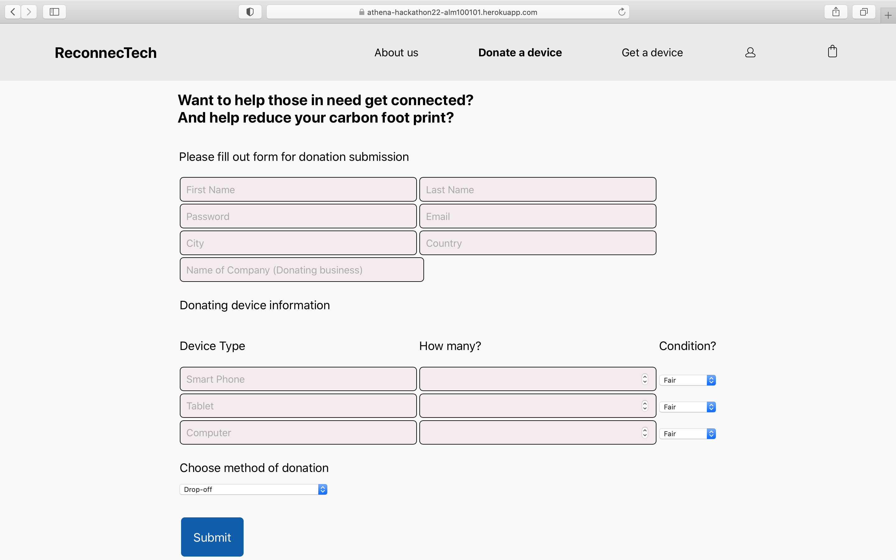
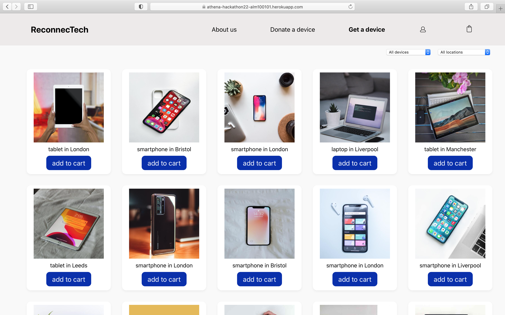

# ReconnecTech

ReconnecTech is a web app that facilitates providing refurbished tech devices (such as smartphones, tablets, and laptops) to refugees and people with low to no means. 

The project's aim is to improve digital inclusion while reducing electronic waste.

- Businesses that donate their older devices receive tax incentive while meeting their environmental initiatives.


- Individuals who donate receive tax incentive and do their part in supporting a circular economy.


- Recipients of new used device help close the technology gap, find opportunities for work and education, while connecting with family & friends.

[live demo](https://athena-hackathon22-alm100101.herokuapp.com/)

## Hackathon 

The app was made in only 1.5 day for the Athena Hackathon on June 11th, 2022. The Hackathon's themes drew upon refugees' social inclusion and businesses' environmental initiatives. 

We collaborated as a team of 3 (Audrey, Mansi, and Lisa) to build the project from the ground up in a short time - from ideation, to prototyping and coding.

## App Features
- Registration for donors (businesses/individuals) and donation submission
- Registration for recipients (people in need/refugees)
- Shop where recipients browse through the inventory and order devices 

## Future improvements
- A matching system connecting donations to refurbish hubs
- A tracking system to ensure the successful distribution of donated device
- Gamification through gold, silver, and bronze badges for top donators
- Recipient reviews page

## Tech stack
TypeScript, React, Node.js, Express, PostgreSQL <br />
Live demo deployed through Heroku

## Local installation 

- Clone the repository 
```bash
git clone https://github.com/AudreyKj/athena-hackathon22-inclusive-app.git
```

- Install dependencies 
```bash
npm install
```

- Set up a PostgreSQL database:

Set up a PostgreSQL database (download [PostgreSQL](https://www.postgresql.org/download/) if necessary) and add the database credentials in a `.env` file. Once the database is created, connect to your database `psql -d databaseName`, and create the tables found in `database/tables`.

- Run a development server:

Concurrently in 2 different tabs:
```bash
npm start
```

```bash
cd client 
npm start
```

## Credits
Audrey Kadjar (web development), Mansi Patel (web development), Lisa McClain (UI/UX design)

## Screenshots 




